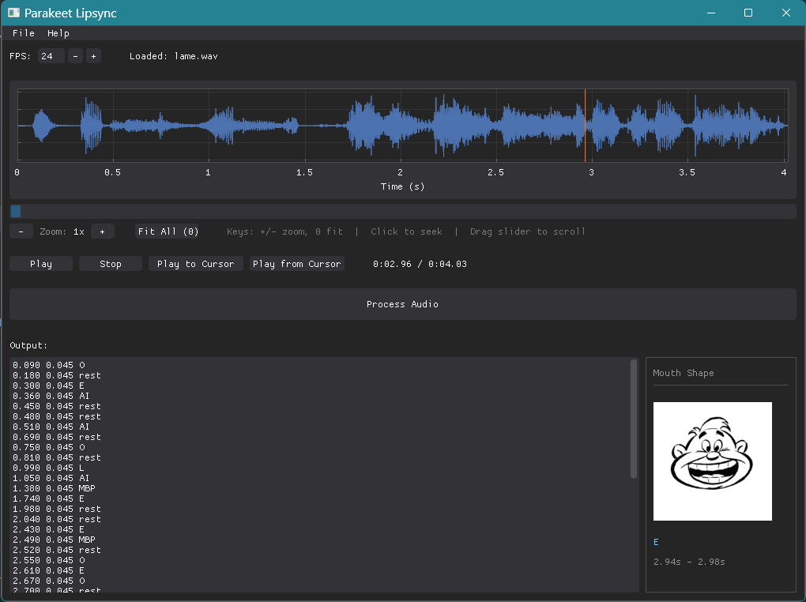

# Parakeet Lip Sync

Parakeet Lip Sync is an open-source automatic lip-syncing tool for 2D animation. It analyzes audio recordings and generates mouth shape timings that can be exported for use in animation software.

## About

Inspired by tools like [Papagayo](https://www.lostmarble.com/papagayo/), [Yolo](https://yolo.sourceforge.net/), and [Rhubarb Lip Sync](https://github.com/DanielSWolf/rhubarb-lip-sync), Parakeet aims to provide a modern, deep learning-powered alternative that is fully open-source.

This project is under development. Don't be surprised if it crashes 🐛, burns 🔥, eats your lunch 🍔, or fails to behave as it's supposed to 😱.

## Features

- **Automatic phoneme recognition** - Uses deep learning to detect speech sounds
- **Real-time waveform visualization** - View and navigate audio with zoom/scroll
- **Live mouth shape preview** - See the current mouth shape during playback
- **Export formats**:
  - Text output (timestamp, duration, mouth shape)
  - Moho/Anime Studio timesheet (.dat)
- **Keyboard shortcuts** for efficient workflow
- **Cross-platform** - Built with DearPyGui

## Installation

### Using uv (recommended)

```bash
# Install uv if you haven't already
# https://docs.astral.sh/uv/getting-started/installation/

# Clone the repository
git clone https://github.com/hnhparitosh/ParakeetLipSync.git
cd parakeet_lipsync

# Run the application
uv run parakeet
```

### Development Setup

```bash
# Sync dependencies
uv sync

# Run in development mode
uv run python -m parakeet_lipsync.main
```

## Usage

1. **Open an audio file** (`Ctrl+O`) - Supports WAV and MP3 formats
2. **Preview the audio** - Use playback controls or click the waveform to seek
3. **Process the audio** - Click "Process Audio" to run phoneme recognition
4. **Review the output** - Watch the mouth shape preview during playback
5. **Export** - Save as text or export as Moho timesheet

## Keyboard Shortcuts

| Shortcut | Action |
|----------|--------|
| `Ctrl+O` | Open audio file |
| `Ctrl+S` | Save output |
| `Space` | Play/Pause |
| `+` | Zoom in |
| `-` | Zoom out |
| `0` | Fit all (reset zoom) |

## Roadmap

- [x] Basic GUI with DearPyGui
- [x] Automatic lip-sync using Allosaurus
- [x] Audio waveform visualization
- [x] Zoomable/scrollable waveform
- [x] Real-time mouth shape preview with images
- [x] Moho timesheet export (.dat)
- [x] Keyboard shortcuts
- [ ] Support for more export formats (Toei XDTS, etc.)
- [ ] Editable timeline for manual corrections
- [ ] Custom phoneme-to-mouth-shape mappings
- [ ] Batch processing multiple files
- [ ] Custom model support (replace Allosaurus)

## Tech Stack

- **GUI**: [DearPyGui](https://github.com/hoffstadt/DearPyGui)
- **Audio Processing**: [librosa](https://librosa.org/), [sounddevice](https://python-sounddevice.readthedocs.io/)
- **Phoneme Recognition**: [Allosaurus](https://github.com/xinjli/allosaurus)



## Acknowledgments

- [Papagayo-NG](https://github.com/morevnaproject/papagayo-ng) - Inspiration for design, UI.
- [Yolo](https://yolo.sourceforge.net/) - Inspiration for UI/UX
- [Allosaurus](https://github.com/xinjli/allosaurus) - Phoneme recognition model
- Preston-Blair for the classic mouth shape system used in animation
