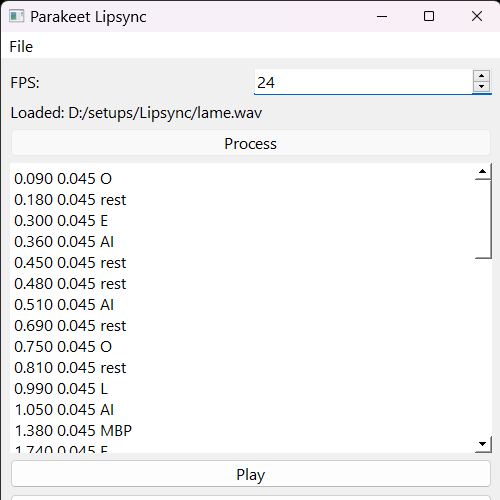

# Parakeet Lip Sync

Parakeet Lip Sync is an automatic lip-syncing tool that helps to create 2d mouth animations from the audio recordings.  

It is inspired from the existing lip-sync softwares like Papagayo, Yolo and Rhubarb. Currently, the existing lip-sync softwares do not use the latest deep learning techniques to generate the lip-syncs or they are not open-source.

Parakeet Lip Sync is an attempt to solve this problem. It uses the latest deep learning techniques to generate the qood quality lip-syncs and is open-source.

This project is under development. Don't be suprised if it crashes, burns, eats your lunch, or fails to behave as it's supposed to.

A video tutorial on how to use Parakeet Lip sync is coming soon.

## Todos for the project

- [x] A minimalistic GUI.
- [x] Automatic lip-sync.
- [x] Support for exporting Moho Timesheet (.dat).
- [x] Common keyboard shortcuts `ctrl + o`, `ctrl + s`, etc.
- [ ] Support for exporting Toei Digital Exposure Sheet (.xdts).
- [ ] A MouthView to view the generated output.
- [ ] A WaveformView to edit the generated output.

## How to use

- Clone this repository.
- Install the dependencies using `pip install -r requirements.txt`
- Run the application using `python main.py`

## Screenshot

